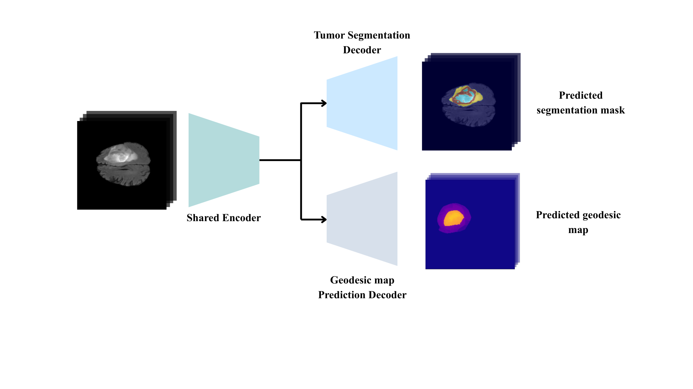

# Geodesic-Constrained Multi-Task Learning with Adaptive Loss Balancing for Adult Glioma Segmentation

## Overview
This repository contains the codebase for the research project **"Geodesic-Constrained Multi-Task Learning with Adaptive Loss Balancing for Adult Glioma Segmentation"** by Janaka Dilshan Sendanayake. 

The study proposes a novel **Boundary-Aware Dual-Decoder U-Net** that improves the precision of brain tumor boundaries in 3D MRI scans. It utilizes a multi-task learning approach to simultaneously perform volumetric tumor segmentation and continuous boundary regression using Signed Normalized Geodesic (SiNG) distance maps. 

## Adaptive Loss Balancing Equation
To effectively balance the multiple objectives without manual hyperparameter tuning, the model integrates a self-adapting, uncertainty-weighted multi-task loss function based on homoscedastic uncertainty. The total loss is formulated as:

$$
\mathcal{L}_{Total} = \frac{1}{2\sigma_{seg}^2} \mathcal{L}_{Seg} + \frac{1}{2\sigma_{geo}^2} \mathcal{L}_{Geo} + \frac{1}{2\sigma_{cons}^2} \mathcal{L}_{Cons} + \log(\sigma_{seg} \cdot \sigma_{geo} \cdot \sigma_{cons})
$$

Where:
* $\mathcal{L}_{Seg}$ is the Segmentation Loss (e.g., Dice/Cross-Entropy).
* $\mathcal{L}_{Geo}$ is the Geodesic Regression Loss (e.g., L1 Loss).
* $\mathcal{L}_{Cons}$ is the Consistency Loss.
* $\sigma_{seg}, \sigma_{geo}, \sigma_{cons}$ are the trainable learnable noise parameters (uncertainty) for each respective task.

## Key Features
* **Boundary-Aware Dual-Decoder U-Net:** A lightweight architecture featuring a single shared encoder and two specialized decoders.
* **Geodesic Distance Maps (SiNG):** Predicts continuous spatial distances to the tumor boundaries rather than relying solely on hard labels.
* **Out-of-Distribution (OOD) Robustness:** Demonstrates superior boundary stability (lowest HD95) on zero-shot benchmarking across BraTS Africa, Pediatrics, and Meningioma datasets.

## Repository Structure
* **`Geodesic_maps_generation/`**: Scripts and notebooks for processing standard BraTS ground-truth masks into continuous SiNG Distance Maps.
* **`proposed_architecture_training/`**: Training and inference pipelines for the Uncertainty-Weighted Dual-Decoder U-Net.
* **`ablation_studies/`**: Notebooks justifying architectural components via quantitative and qualitative evaluations.
* **`benchmarking/`**: Zero-shot stress testing against standard architectures (nnU-Net v2, Swin UNETR, SegResNet) across OOD datasets.

## Requirements
* `Python 3.12`
* `PyTorch` (with Automatic Mixed Precision support)
* `MONAI`
* `FastGeodis` (for efficient geodesic distance transforms)

## Citation
If you utilize this codebase or find our research helpful, please cite the primary thesis for now. The corresponding journal article is currently **under review at the IEEE Journal of Biomedical and Health Informatics (JBHI)**. This repository will be updated with the official publication citation once accepted.

**Cite as:**
> Sendanayake, J. D. (2026). *Geodesic-Constrained Multi-Task Learning with Adaptive Loss Balancing for Adult Glioma Segmentation* [BSc. (Hons) Thesis, Informatics Institute of Technology / Robert Gordon University].

## Acknowledgments
A special thanks to the authors of the **SiNGR** framework. The geodesic distance map transformation process (found in `Geodesic_maps_generation/`) utilized in this research is inspired by and adapts their methodology. 

If your work specifically builds upon the SiNG distance maps generated in this codebase, please also ensure you credit their original work:

> Dang, T., Nguyen, H. H., & Tiulpin, A. (2024). *SiNGR: Brain Tumor Segmentation via Signed Normalized Geodesic Transform Regression*. arXiv preprint arXiv:2405.16813. Available at: https://arxiv.org/abs/2405.16813
